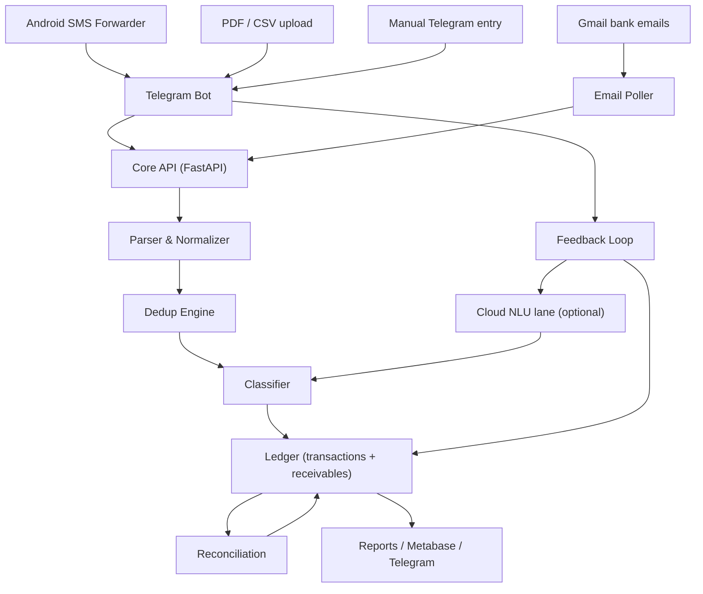

# Personal Finance Tracker - Final Implementation Plan (v1.0)

Single authoritative spec. Built from three planning sessions: original blueprint, AI/N8N review, and the prototype's smoke test + code review. Start of build is decided by the user - this document is the contract we build against.

Scope: Single-user, India (UPI / GPay / CRED / credit cards / Amazon Pay / Slice). Constraint: 100% free tooling.

---

## 1. Mission

A single trustworthy ledger of every rupee that moves, built from multiple free channels (SMS, email, PDF/CSV exports, Telegram), that:

1. Never double-counts a transaction regardless of source, order, or delay (SMS first, email hours later, PDF 45 days later, Telegram anytime).
2. Handles shared expenses like a banker: flag at spend, track the receivable, net on settlement, and never mistake a reimbursement for income.
3. Asks you questions only when it matters (trigger-driven Telegram loop), stays quiet otherwise, and degrades gracefully.
4. Reconciles to your bank statement monthly - the bank is the source of truth.

Pipeline: **Ingest -> Parse -> Normalize -> Dedup -> Classify -> Ledger -> Reconcile -> Report**.

---

## 2. Architecture



**Component split (final):**
- **Core API (FastAPI + SQLAlchemy)** - the brain: parsers, dedup, classification, settlements, ledger, bot commands. Runs standalone for dev (SQLite), full deployment (Postgres). This is where all correctness lives.
- **N8N (optional, self-hosted)** - only the glue: Gmail polling trigger, statement-upload handler, scheduled daily/monthly digests. Calls the Core API's webhooks. Removes the need for any public webhook on the phone side (Section 3.2).
- **Telegram Bot** - the only UI you touch.
- **Metabase (optional)** - dashboards; Telegram monthly report is the zero-effort default.
- **AI (optional)** - a single narrow NLU node via free-tier cloud LLM API (Gemini/Groq free); no local model (Section 6.3).

---

## 3. Ingestion

| Channel | How it arrives | Real-time? |
|---------|---------------|------------|
| Bank SMS | SMS Forwarder (Android) -> Telegram bot (native support) | Yes (within 1-5 min poll) |
| Bank email | Gmail -> N8N email poll / Apps Script | Yes (poll) |
| PDF statement | You send it to the Telegram bot | Manual, monthly |
| UPI-app CSV (GPay/CRED) | Upload to Telegram bot | Manual |
| Manual entry | Type to bot: `dinner 450` or `group dinner 900 share 300` | On demand |
| Settlement | Inbound credit SMS/email | Yes |

### 3.1 Raw event log (non-negotiable)
Every message (raw SMS text, raw email, uploaded file) is stored immutably first: `ingestion_id, source, channel, received_at, raw_payload`. Nothing is dropped, even duplicates. This is the audit trail that makes every decision explainable.

### 3.2 Connectivity: phone -> Telegram -> poll (no webhook, no tunnel)
Phone and laptop are both behind NAT. Flip the direction: SMS Forwarder pushes to your Telegram bot; the always-on VM **polls** Telegram/Gmail (both N8N and the Core bot can long-poll). No public webhook, no port forwarding, no tunnel. Latency is "every 1-5 minutes" - fine for a tracker. Phone and laptop can both be off; the VM does all the work.

---

## 4. Parsing & Normalization

### 4.1 Per-bank parsers
Table keyed on SMS sender ID / email domain. Extract: `txn_date, txn_time, amount, type (debit/credit), counterparty, account, mode (UPI/CARD/NEFT/IMPS), reference (UTR)`. Each field carries a **confidence score**; raw text is always retained.

### 4.2 Normalization rules
- Amount -> integer **paise** (`450.50` -> `45050`). Never floats.
- Date -> ISO-8601, fixed timezone.
- Counterparty -> lowercase, strip `UPI/` and VPA suffixes (`ravi@ybl` -> `ravi`), alias map (`PAYTM`/`Paytm`/`paytm` -> `paytm`).
- Reference kept verbatim.
- **Bare amounts** (`450.00 debited`) must be given direction from surrounding words - never default to positive (Prototype Bug D).
- **UTR extraction** requires a `ref`/`utr`/`upi` label in context - a bare 12-digit number (order ID, phone) is NOT a UTR (Prototype Bug E).

---

## 5. Deduplication Engine (two-tier, merge-not-insert)

### 5.1 Why ordering breaks naive dedup
The same txn arrives seconds (SMS), hours (email), days (CSV), or 45+ days (PDF) apart. Naive "same amount same day" both merges two real purchases and misses late duplicates.

### 5.2 Tier 1 - Exact (UTR/ref)
`sha256(mode + account + date + amount + type + reference)` with a unique index. Same UTR = same transaction, forever. Highest confidence, zero ambiguity.

**Design rule (Prototype Bug A):** a repeated UTR is always a duplicate, regardless of source - including the same source re-sending (SMS Forwarder retries). Never let it hit the DB unique constraint as a crash - catch and log as idempotent dedup.

### 5.3 Tier 2 - Fuzzy fingerprint (no UTR; e.g., card PDFs)
`abs(amount) + account + normalized counterparty + date within +/-3 days`.

**Design rules:**
- **Signed amount** - match on the same debit/credit direction. A Rs 600 credit must never match a Rs 600 debit (Prototype Bug C).
- **Near-date merges are never silent** - when dates differ by more than a day, flag `needs_review` for you (Prototype Bug F).
- Ambiguous (multiple same-day candidates) -> `needs_review`, never auto-merge.

### 5.4 Match resolution

| Outcome | Condition | Action |
|---------|-----------|--------|
| EXACT | UTR/ID hit (Tier 1) | Auto-merge, add source alias, discard copy |
| STRONG | Tier 2 hit, unique in window, same date | Auto-merge, enrich canonical, add alias |
| WEAK / needs_review | fuzzy mid-band, multi-candidate, or date drift | Queue to Telegram `[Merge] [No]` |
| NEW | no match | Insert (status `pending`), run classification |

### 5.5 Channel priority for canonical copy
SMS (5) > Email (4) > Telegram manual (3) > UPI-app CSV (2) > PDF (1). Every corroborating source recorded as an **alias** on the canonical row (`sources: [sms, email, card_pdf]`).

### 5.6 Confidence ladder
| Status | Reached by |
|--------|------------|
| `pending` | Single source |
| `confirmed` | 2+ independent sources, or you acknowledged it |
| `verified` | Monthly reconciliation passed |

Reports count `confirmed`/`verified` as hard numbers; `pending` shows as provisional.

### 5.7 Reconciliation as the long-tail safety net
Monthly statement (PDF/CSV): any statement line not matched -> missed txn, insert as NEW with `source=statement`. Any record not on the statement -> anomaly flag. Backdated/late entries recompute aggregates idempotently from events (never store pre-computed totals).

---

## 6. Classification (pipeline order is a rule)

```
dedup -> settlement-match -> credit-type -> category
```

### 6.1 Credit typing before categorization (Prototype Bug: ravi@ybl -> "bills")
Money coming **in** is typed first: `reimbursement`, `refund`, `income` - only `income` is income. A spend category is never applied to inbound money. Known-persons list is checked before any category regex.

### 6.2 Category classifier rules
1. Known-persons list (from group settlements) first.
2. Merchant alias map second.
3. Keyword regex last - always with **whole-word anchors on both sides** (`\bvi\b`, never `vi\b` which matches inside "ravi").
4. Non-rounded amounts, known persons, shared categories, or amounts above threshold -> trigger the shared prompt (Section 7).

### 6.3 AI lane - a single narrow NLU node (cloud free tier, no local model)
AI's only job is **understanding user input** - the task that is genuinely easier for AI than code:

- `dinner 450 sam` -> `{amount: 450, merchant: sam, category: food}`
- `group dinner 900 share 300` -> create group expense with share
- `received 500 from ravi for dinner` -> settlement intent
- `add 200 to emi` -> emi_group tag

Implementation choices:
- **Model: free-tier cloud LLM API** (Google Gemini free tier or Groq free tier) - no Ollama, no local hardware burden. Personal usage fits the free quota easily.
- **Privacy contract:** the LLM sees ONLY the free text you type into Telegram plus an allowlist of your categories/persons. It NEVER sees raw bank SMS, account/card numbers, balances, or UTRs. Merchant name + amount is not sensitive; the raw bank feed stays entirely on your VM.
- **Strict output:** the model returns JSON against a fixed schema; a validation step rejects malformed output and falls back to the deterministic parser + your confirmation. AI failure = graceful degradation to rules, never silent wrong data.
- **Deterministic core is untouched:** UTR extraction, dedup, settlement matching, and category enforcement stay in code. The LLM never "corrects" a UTR or merges transactions - that is silent ledger corruption.

Everything else (dedup, classification of known merchants, settlements, reconciliation) remains deterministic rules - the system works 100% without the AI lane.

---

## 7. Shared Expenses & the Feedback Loop

### 7.1 Transaction state machine (tag now, compute later)
| State | Meaning |
|-------|---------|
| `personal` | Normal expense. Done, no prompt. |
| `maybe_shared` | Heuristic suspect; awaiting your answer. Best-effort, never blocking - shows in "needs review". Still in gross spend. |
| `flagged_shared` | You said Yes. Share **not yet known**. Full amount stays in spend until resolved. |
| `resolved_shared` | Share computed at settlement: `full - received = your_share`. Aggregates recompute to net. |

### 7.2 Flagging shared is NOT creating a receivable (Prototype finding)
The settlement matcher only matches an actual **`group_expense`** record - this is correct and safe (auto-matching flagged txns to inbound money creates false positives). Therefore: after "Yes, shared", the bot MUST surface a **"Create group expense"** action. That action is what makes the receivable real and matchable. This is an explicit UX requirement.

### 7.3 Trigger-driven prompts (not universal)
Prompt only when a heuristic suspects shared: odd/non-rounded amounts, known-person counterparty, naturally-shared category (restaurant, grocery, hotel, fuel, movie), amount above threshold (Rs 500), or inbound settlements. Everything else is auto-`personal`. Configurable "ask me about everything" toggle for the first weeks.

### 7.4 Settlement matching (conservative by design)
- On an inbound credit from a person: if **exactly one** open `group_expense` matches, or the sender is a known person with an open group -> ask `[Confirm] [No]`. On confirm, receivable closes, share computed, reports recompute.
- **Design rule (Prototype Bug B):** if two open group expenses both expect the same amount, or the sender is unknown -> **leave unmatched** and ask you to pick. Never guess the wrong group.
- Handles: partial settlement, one payment settling multiple expenses, group net-balance settlements, cash reimbursements (manual flag), over-payment (goes to `prepaid` balance for that group), reimbursement reversal, aging reminders (7/30/60 days), write-offs.

### 7.5 Prompt hygiene
- Debounce SMS floods: batch ~60s, up to 5 inline buttons per message.
- Quiet hours 23:00-07:00; auto-snooze if you keep ignoring prompts.
- **Idempotent confirmations**: the prompt carries the dedup key - you answer once even if the txn arrived via SMS + PDF + Telegram; the flag applies to the single canonical row.

---

## 8. Reconciliation (monthly, bank = truth)

1. Group canonical txns by account + statement cycle.
2. Sum debits/credits; compare to statement totals / closing balance.
3. Statement lines not matched -> missed txns (insert as NEW, `source=statement`).
4. Records not on statement -> anomaly flag (possible stray/unauthorized).
5. Telegram report: "Reconciled. 3 missed, 1 anomaly, 0 duplicates."

KPIs: capture rate >= 98%, duplicate auto-catch > 95%, false-merge ~0%, needs_review drained in 48h.

---

## 9. Banker's Edge-Case Checklist (all in scope)

1. Authorization vs settlement (pending holds; only settled counts).
2. Transaction date vs value date vs posting date (store all three; report by txn date; reconcile by cycle).
3. Refunds / reversals / chargebacks: net against original; refund of shared expense reduces the receivable.
4. Rounding & precision: paise integers everywhere.
5. EMI: `emi_group` so statement shows real liability, budget shows the obligation.
6. Recurring subscriptions: known schedules pre-flag + dedup.
7. Merchant aliases & truncation: alias map + fuzzy.
8. Identical same-day purchases: UTR wins; without UTR, ambiguity -> human, never auto-merge.
9. Cash & offline spend: manual entry path + monthly "did I miss cash?" check.
10. Multi-currency / forex: store original currency + rate + INR equivalent.
11. TDS / statutory deductions: `tax` tag, not spend.
12. Shared cards / family members: "Not mine" archives, stays in audit log.
13. Fraud / anomaly detection: amount outliers, duplicate charges, unknown entries surface at reconciliation.
14. Data quality confidence: low-confidence parses shown for correction, never silently trusted.
15. Long-tail duplicates: caught by reconciliation, not windowed fuzzy.
16. Privacy: SMS data sensitive (OTPs/balances) - filtered at source, kept on own VM, full export available.
17. Credit lines disguised as wallets (CRED / Slice / Amazon Pay Later): liabilities, not wallet debits. `emi_group` tags them; bill payment = liability settlement, excluded from spend.
18. Rewards / cashback credits: `rewards` category, never income, never a reimbursement.
19. Card payment vs card spend: card bill payment is a liability settlement, excluded from spend.
20. Wallet top-ups (Amazon Pay balance / GPay): transfers, not spend; both sides tagged.
21. Failed / declined / reversed txns: `FAILED`/`REVERSED` state, excluded or netted - the biggest source of phantom spend.
22. Three credit types never conflated: Refund (nets expense) / Reimbursement (closes receivable) / Income (only true income).
23. Bill-level grouping: `bill_id` above transactions - one dinner paid 3 ways = one logical expense.
24. Multi-account self-transfers: excluded from spend, tracked for balance verification.
25. Source format drift: any parse failure -> unmatched queue + alert; parser version field per record.
26. Backdated / late entries: attributed to txn date; aggregates recomputed idempotently.
27. **ATM / cash withdrawals**: cash-out is a transfer to cash, not merchant spend; the ATM fee is a real expense (`fees` tag). Detect withdrawal keywords and split the fee out.
28. **Bank fees / penalties / interest charges**: `fees` category, never spend and never income - surfaced in reconciliation so you notice creeping charges.
29. **Proactive bill reminders**: the `recurring` table fires "Rent due in 3 days" / "Netflix due today" alerts - the tracker nudges, not just records.
30. **Search**: `/find zomato aug` or `/find 450` from the bot - locate any past transaction quickly (index on counterparty_norm + date + amount).
31. **System health**: a free monitor (UptimeRobot) pings `/health` and alerts to Telegram if the VM or API is down, so you notice an outage within minutes, not weeks.

---

## 10. Data Model (schema)

| Table | Key columns | Notes |
|-------|-------------|-------|
| `events` | ingestion_id, source, channel, received_at, raw_payload | Immutable audit log |
| `transactions` | id, txn_date, value_date, posting_date, amount_paise, currency, fx_rate, type, mode, counterparty_norm, account, utr, key_exact, key_soft, status(pending/confirmed/verified), lifecycle(active/failed/reversed), txn_state(personal/maybe_shared/flagged_shared/resolved_shared), credit_type(refund/reimbursement/income/null), ownership(mine/not_mine), category, bill_id, emi_group, sources[], parser_version, needs_review | Canonical ledger |
| `accounts` | id, name, type(bank/wallet/card/cash), institution, last_verified_balance_paise, last_reconciled_at | Balance source of truth; reconciliation target |
| `dedup_map` | canonical_id, source, raw_id, matched_at | Every merge/alias |
| `refund_links` | txn_id, original_txn_id, amount, confidence, matched_at | Refund credit linked back to original expense |
| `group_expenses` | id, ledger_id, person/group, full_amount, share_amount, expected_receivable, received_so_far, status(open/partial/settled/written_off) | The receivable |
| `settlements` | id, txn_id, group_expense_id, amount, kind(partial/full/overpay/cash) | Match link |
| `persons` | id, name, vpas[], aliases[] | Known-persons list |
| `pending_actions` | id, chat_id, step, context_json, created_at, updated_at | Multi-step bot conversations (create group expense, settle picker, etc.) |
| `audit` | id, actor, action, entity, before, after, reason, at | Every manual edit/merge/delete |
| `balances` | person_id, net_receivable | Derived, recomputable |
| `recurring` | id, pattern(monthly/quarterly), expected_amount, category, merchant, last_seen_at, active | Known subscriptions/bills - pre-flag + reminders |

Engine: SQLite for dev, Postgres for deploy. All aggregates are derived - never stored totals (late entries recompute idempotently).

### 10.1 Refund matching (how a refund links back to the original)
Refunds arrive as `CREDIT`s without the original UTR, so the linker is separate from dedup:
- Candidate scan: original expense with same counterparty, amount >= refund, `lifecycle=active`, within the last 45 days.
- Exactly one candidate -> auto-link, refund nets against it (`refund_links`).
- Multiple candidates -> `needs_review`, you pick. None -> leave unmatched, type as `refund` anyway and reconcile later.
- A refund of a shared expense also reduces the receivable (never income).

---

## 11. Tech Stack & Free Hosting

### Primary (recommended)
| Component | Choice | Cost |
|-----------|--------|------|
| Core API | FastAPI + SQLAlchemy (self-contained) | Rs 0 |
| DB | SQLite (dev) / Postgres (deploy) | Rs 0 |
| Orchestration glue | N8N self-hosted (email poll, digests, statement upload) | Rs 0 |
| Bot | Telegram Bot API | Rs 0 |
| Host | Oracle Cloud **Always Free** ARM (4 OCPU / 24 GB) or Google Cloud e2-micro free | Rs 0 |
| Dashboards | Metabase or Telegram monthly report | Rs 0 |
| AI (optional) | Free-tier cloud LLM API (Gemini free / Groq free) - NLU only, no local model | Rs 0 |
| SMS intake | SMS Forwarder (open source) | Rs 0 |

### Fallback (zero infra)
Google Apps Script + Sheets: same domain logic, AI via free-tier LLM API, PDF via Drive OCR. Weaker PDF parsing, less private - acceptable if you refuse to manage a VM.

Deploy: single `docker-compose.yml` - Postgres + Core + N8N + Metabase. Phone and laptop can be off; VM does all work (polling, no tunnels).

---

## 12. Build Roadmap (code starts only on your word)

| Phase | Deliverable | Exit criteria |
|-------|-------------|---------------|
| 0 | Repo scaffold, schema, raw event log, health endpoint | API boots, events logged |
| 1 | Parser + normalizer (SMS/email/CSV) for one bank + GPay | Correct fields incl. UTR, direction, paise |
| 2 | Dedup engine (Tier 1 UTR, Tier 2 fingerprint, alias, needs_review) + 5.2-5.4 rules | Zero dupes across SMS+email+PDF; regression tests A-F pass |
| 3 | Telegram bot: ingest, classify, trigger-driven shared prompt, "Create group expense", debounce/quiet hours | 95% entries handled via bot |
| 4 | Group expenses + settlement matching (conservative rule B) + receivables + balances | Net shared position accurate |
| 5 | Reconciliation + confidence ladder + anomaly report + accounts balance check + refund matching | Capture >= 98%, accounts reconcile |
| 6 | Reports: categories, monthly digest, takeout, `/find` search, bill reminders | Full monthly report |
| 7 | Hardening: credit-line/EMI tagging, more banks, OCR PDFs, NLU AI lane, format-drift alerting, health monitor, backups, KPIs | Runs unattended 3 months |

Each phase ends with tests + a Telegram summary of what was verified.

---

## 13. Security & Privacy

- **Bot allowlist**: the Telegram bot accepts commands only from your allowlisted user ID(s); anyone else is ignored (never responds, never sees data).
- **Webhook auth**: N8N -> Core API calls carry a shared secret token; Core rejects unauthenticated requests (prevents spoofed ingests).
- **Filter at the source**: SMS Forwarder forwards only transaction messages, **never OTPs**.
- **Secrets** (bot token, DB creds, webhook secret): in env / docker secrets, never committed.
- **Data residency**: raw bank feed stays on your VM. The AI lane sends ONLY the free text you type into Telegram (never raw bank SMS, account numbers, balances, or UTRs) to a free-tier LLM API.
- **Backups (free & concrete)**: nightly `pg_dump` -> compressed -> uploaded to your **Telegram Saved Messages** (private to you) or any free cloud drive via rclone. Restore = pull latest dump, `pg_restore`.
- **Health alerting**: UptimeRobot free tier pings `/health`; on failure it calls a Telegram alert webhook so you know within minutes.
- **Encryption at rest**; immutable audit trail for every manual action; full CSV takeout anytime.

---

## 14. Decisions Log (locked)

| # | Decision |
|---|----------|
| 1 | Hosting: Oracle Cloud Always Free (N8N + Postgres + Core + Metabase); Google e2-micro fallback; Google zero-server last resort |
| 2 | First parsers: one bank + GPay, then CRED / Amazon Pay / Slice (as credit lines) |
| 3 | Shared flag: flag-only by default; share% or amount calculated if you supply it at flag time |
| 4 | Settlement: human-confirmed; auto-match only when exactly one candidate or known-person sender |
| 5 | AI: single narrow NLU node (free-text -> structured JSON) on free-tier cloud API (Gemini/Groq). No local Ollama. LLM never sees raw bank data; deterministic core always works standalone (Section 6.3) |
| 6 | Confidence: pending -> confirmed -> verified |
| 7 | Prompting: trigger-driven; "ask everything" toggle available |
| 8 | State machine: personal -> maybe_shared -> flagged_shared -> resolved_shared |
| 9 | Connectivity: phone -> Telegram -> poll; no tunnels |
| 10 | Failed/reversed excluded; 3 credit types never conflated |
| 11 | Flag != receivable; bot surfaces "Create group expense" |
| 12 | Pipeline order: dedup -> settlement-match -> credit-type -> category |
| 13 | Code starts only on explicit user instruction; every phase committed + pushed to this repo |
| 14 | **Refunds**: linked back to original expense (merchant + amount + 45-day window); ambiguous -> needs_review. Refund of shared expense reduces the receivable (Section 10.1) |
| 15 | **Bot security**: Telegram user-ID allowlist; shared-secret auth on N8N->Core webhooks; nightly encrypted backups to Telegram Saved Messages; UptimeRobot health alert (Section 13) |
| 16 | **Accounts ledger**: per-account balances tracked and reconciled monthly, not just transactions (Section 10) |
