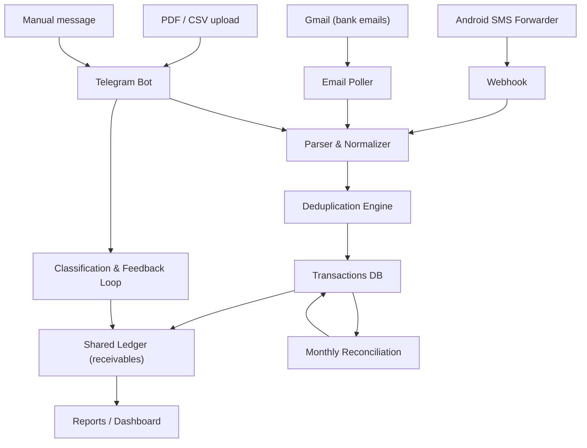

# Personal Finance Tracking System - Professional Blueprint

Version 1.0 | Scope: Single-user, India-centric (UPI / GPay / CRED / credit cards / Amazon Pay) | Constraint: 100% free tooling

---

## 1. Executive Summary

The goal is a single, trustworthy ledger of all personal money movement, built only from free components, that:

1. Ingests transactions from many channels: bank SMS, bank email, UPI app exports (CSV), PDF statements, and Telegram messages.
2. Never double-counts a transaction regardless of how many channels report it or in what order they arrive (SMS first, email later, PDF up to 45 days later, Telegram manual updates in between).
3. Handles the shared-expense edge case properly: flag expenses as shared, track the expected reimbursement as a receivable (not income), and net it out when money actually comes back.
4. Puts a human-in-the-loop feedback loop on Telegram: every new entry is confirmed/categorized, shared expenses are flagged, and open receivables are reconciled over time.

The architecture is a pipeline: **Ingest -> Parse -> Normalize -> Deduplicate -> Persist -> Classify (feedback loop) -> Report**.

---

## 2. System Requirements

| # | Requirement |
|---|-------------|
| R1 | Multi-source ingestion: SMS, Email, PDF export, UPI-app CSV, Telegram manual entry |
| R2 | Zero duplicates even with out-of-order arrival across channels |
| R3 | Shared-expense lifecycle: flag -> track receivable -> match reimbursement -> settle |
| R4 | Reimbursements must be recorded as "return of my money", never as income |
| R5 | Telegram feedback loop for classification and shared-expense flagging |
| R6 | Monthly bank statement reconciliation (catch missing or stray transactions) |
| R7 | Reports: monthly spend by category, shared ledger net per person, cashflow |
| R8 | All components must cost Rs 0 (free tiers / self-hosted OSS only) |
| R9 | Privacy: SMS data is sensitive; no raw OTPs ever leave the device |

---

## 3. High-Level Architecture



All components are free (details in Section 11).

---

## 4. Ingestion Layer (Multiple Sources, One Pipeline)

### 4.1 Bank SMS (fastest signal)
- Android app **SMS Forwarder** (free, open source) monitors the inbox for bank sender IDs (e.g., HDFCBK, VJPAY, PAYTM, ICICIB).
- Filter ONLY transaction keywords: `spent`, `debited`, `credited`, `UPI`, `txn`, `account`. **Never forward OTP messages**.
- Each SMS is POSTed to the ingestion webhook. The SMS carries the **UTR / UPI reference number**, which is the strongest dedup key available.

### 4.2 Bank Email (slower, richer)
- Gmail receives bank alerts and monthly statements.
- A poller (IMAP or Gmail API) reads matching labels and pushes body + attachments into the pipeline.
- Emails usually arrive minutes to hours after the SMS for the same transaction.

### 4.3 PDF Statements (authoritative but stale)
- User sends the PDF to the Telegram bot (manual, monthly).
- Text-based PDFs parsed with a PDF text extractor; scanned PDFs run through free OCR (Tesseract).
- Used for **month-end reconciliation** (Section 8), not real-time tracking.

### 4.4 UPI App Exports (CSV)
- GPay / PhonePe / Paytm statement exports (CSV) are uploaded to the Telegram bot or a webhook.
- These contain the UTR column, which makes dedup near-perfect.

### 4.5 Telegram Manual Entry
- Free-text: `450 zomato` or `-450 zomato`, optional category and date.
- Also supports marking reimbursements: `received 500 from ravi for zomato`.

### 4.6 Raw Event Log (non-negotiable)
Every message (raw SMS text, raw email, uploaded file) is stored as an immutable event with:
`ingestion_id, source, channel, received_at, raw_payload`.
Nothing is dropped, even duplicates. This is the audit trail that makes every later decision explainable.

---

## 5. Parsing & Normalization

### 5.1 Parser
Bank SMS formats differ (HDFC vs ICICI vs Axis vs Paytm). Maintain a **per-bank parser table** keyed on sender ID / email domain. Each parser extracts:

- `txn_date`, `txn_time`
- `amount` (decimal)
- `type` (`DEBIT` / `CREDIT`)
- `counterparty` (merchant or person name, e.g. "Paytm", "Zomato", "Ravi")
- `account` (masked, e.g. "XX1234")
- `mode` (`UPI`, `CARD`, `NEFT`, `IMPS`)
- `reference` (UTR / ref number if present)

Each field also gets a **confidence score**. Raw text is always retained next to the parsed fields.

### 5.2 Normalizer
- Amount -> integer **paise** (`450.50` -> `45050`). Never use floats for money.
- Date -> ISO-8601, fixed timezone.
- Counterparty -> lowercase, strip `UPI/`, strip prefixes/suffixes like `Paytm Payments Bank` -> alias map (`PAYTM`, `PayTM`, `paytm` all -> `paytm`).
- Reference -> kept verbatim (UTR is case-sensitive in matching).

---

## 6. Deduplication Engine (The Core)

### 6.1 Why ordering across channels breaks naive dedup
The same transaction arrives multiple times and out of order:

| Order | Channel | Delay |
|-------|---------|-------|
| 1 | SMS | seconds |
| 2 | Email alert | minutes to hours |
| 3 | Telegram manual note | user-dependent |
| 4 | UPI app CSV | when exported |
| 5 | PDF statement | up to 45 days later |

A naive "same amount on same day" check fails in both directions:
- It merges two genuinely different purchases (two coffees, same amount, same day).
- It misses a duplicate arriving a month later via the PDF.

### 6.2 Fingerprint keys (layered matching)
Compute two keys per record:

| Key | Composed of | Strength |
|-----|-------------|----------|
| `key_exact` | sha256(mode + account + date + amount + type + **reference/UTR**) | Highest. UTR is globally unique per UPI transaction. |
| `key_soft` | sha256(normalized_date + amount + type + normalized_counterparty) | High, but can collide for identical same-day purchases. |

- `key_exact` gets a unique database index. Presence of a UTR makes dedup deterministic forever (even 45 days later).
- `key_soft` is used only as a matching hint within a short window.

### 6.3 Match resolution
For an incoming record, query candidates by: same `type`, same amount, date within +/- 3 days, and (`reference` equal OR normalized counterparty similarity >= 0.85 using Levenshtein/Jaro-Winkler).

| Outcome | Decision | Action |
|---------|----------|--------|
| EXACT | UTR hit | Auto-merge duplicate, log mapping to canonical, discard copy |
| STRONG | key_soft hit + merchant similar + unique in window | Auto-merge, enrich canonical with missing fields (e.g., PDF fills in merchant category) |
| WEAK | fuzzy score in mid band, or multiple same-day candidates | Queue to Telegram: "Duplicate of Rs 450 at Zomato on 08 Aug? [Merge] [No]" |
| NEW | no match | Insert, then trigger the classification feedback loop |

### 6.4 Channel priority (who is the canonical copy)
When merging, the highest-priority channel's record becomes canonical and missing fields are filled from lower-priority records:

SMS (5) > Email alert (4) > Telegram manual (3) > UPI-app CSV (2) > PDF (1)

### 6.5 Reconciliation closes the gaps the fuzzy matcher can't
A UTR-less, out-of-window duplicate (email-only txn that also shows up in the PDF two months later) is caught by **monthly reconciliation** (Section 8), not by windowed fuzzy matching. This is the deliberate design: fuzzy matching stays narrow to avoid false merges, and the statement-based reconciliation is the long-term safety net.

### 6.6 Dedup KPIs
- Duplicate auto-catch rate (target > 95% via UTR)
- False-merge rate (must stay ~0%; every suspected merge with ambiguity is sent to the human)
- Capture rate = recorded / bank statement transactions (target > 98%)

---

## 7. Shared Expenses & Reimbursement Ledger

### 7.1 The banker's model: a clearing account
From a BlackRock/Morgan Stanley standpoint, shared expenses are **not** ordinary expenses. Treat them like a clearing account:

- The full amount is spent and recorded.
- Only the user's **personal share** is real personal spending.
- The friends' share is a **receivable** (money owed to you), and the eventual reimbursement is a **reduction of that receivable**, never income.

### 7.2 Lifecycle (matches your "flag now, calculate later" idea)

| State | What happens |
|-------|--------------|
| `OPEN` | Expense flagged Shared. Ledger row created with `expected_receivable` (user's share; leave blank = flag only, per your preference). |
| `PARTIALLY_SETTLED` | Money returned for part of the share. Receivable reduced. |
| `SETTLED` | Receivable = 0. |
| `WRITTEN_OFF` | Explicit decision: friend never returned it. Removed from active receivables; recorded as real personal loss. |

### 7.3 Reimbursement matching
- An incoming `CREDIT` triggers the bot: "Rs 500 received from Ravi. Reimbursement? [Yes] [No]".
- If Yes -> match against open shared expenses from that person/group. Handles:
  - Partial reimbursement
  - One payment settling multiple expenses (link table)
  - Group settlement where the amount is a net balance, not tied to one expense
  - Cash reimbursement (manual entry; flag as "received offline")
- Net position per person/group: `sum(expected_receivable) - sum(received)` -> a clean "who owes me / I owe" balance.

### 7.4 Edge cases in the shared ledger (banker's review)
- **Aging of receivables**: report shows how long each receivable has been open; reminders fire after configurable periods (e.g., 7 / 30 / 60 days).
- **Over-payment**: friend sends more than the flagged share -> excess goes to a `prepaid` balance against that group, applied to future shared expenses.
- **Multi-person splits**: optional `split_of` group field; default share suggestion = 1/N, but the user can keep it as flag-only (no calculation) until settlement time.
- **Reversal of a reimbursement** (money taken back): handled as a debit against the receivable, not a new expense.
- **Cross-currency**: if a friend repays in a different currency or forex is involved, record amount in original currency + rate; keep INR equivalent for the ledger.

---

## 8. Monthly Reconciliation

Every month-end, when the statement PDF/CSV arrives:

1. Group all canonical transactions by account and month.
2. Sum debits and credits; compare with the statement totals / closing balance.
3. Any statement line not matched to an existing record -> likely a **missed transaction** (SMS never captured). Insert as `NEW` with `source = statement`, then run the classification loop.
4. Any existing record not in the statement -> **flag for review** (possible stray/unauthorized transaction).
5. Publish a Telegram report: "Reconciled. Found 3 missed, 1 anomaly, 0 duplicates."

This is the system's ultimate integrity check and closes every dedup gap left open by Section 6.

---

## 9. Telegram Feedback Loop (your proposed "small feedback loop")

Validated: a human-in-the-loop classification stage is the right call. It solves classification AND acts as a final dedup/attribution safety net.

### 9.1 New-entry prompt
After dedup confirms `NEW`, the bot asks:

```
New expense: Rs 450 at Zomato on 08 Aug 10:32.
[Personal] [Shared] [Split] [Not mine] [Duplicate] [Skip]
```

- **Personal** -> default category guess applied, stored as personal.
- **Shared** -> marks `is_shared`, opens a receivable row. **Flag-only by default** (no split calculation), per your preference. If you provide a share amount or percentage (e.g. typing `shared 50%` or `shared 200`), the system calculates `expected_receivable` immediately from that input. Optionally asks "with whom?" (free text).
- **Split** -> like Shared but always requires a share input at flag time (for users who want netting up front).
- **Not mine** -> archived (e.g., a family member's transaction on a shared card).
- **Duplicate** -> manual duplicate override; can also merge a `WEAK` candidate you previously skipped.
- **Skip** -> defer; default to Personal after 24h (configurable) and note it in the report.

### 9.2 Debouncing (SMS floods)
SMS forwarders often dump several messages at once. Requests are batched: collect for ~60 seconds, then send one message with inline buttons for up to 5 transactions. No notification spam.

### 9.3 Quiet hours
No pings between 23:00 and 07:00; entries queue and are asked the next morning.

### 9.4 Reimbursement prompt
On incoming credits (Section 7.3). Supports matching and partial settlements.

### 9.5 Digests
- **Daily**: "3 expenses categorized, 1 flagged shared."
- **Weekly**: spend by category, open receivables.
- **Monthly**: full report + reconciliation summary.

### 9.6 Why this makes the system more accurate, not just nicer
Every decision goes through a confirmable action, so:
- Ambiguous dedup gets a human override.
- Shared flags are created at point of spend (when memory is fresh), not reconstructed weeks later.
- Receivables are reconciled at point of money movement.
- The user retains full control; nothing is silently auto-categorized forever.

---

## 10. Edge Cases - Banker's Review (BlackRock / Morgan Stanley lens)

1. **Authorization vs settlement**: card/UPI "pending" holds vs posted amounts; only the settled amount is a transaction. Track a pending state to avoid double counting.
2. **Transaction date vs value date vs posting date**: statement cycles straddle calendar months; store all three dates, report by transaction date, reconcile by statement cycle.
3. **Refunds, reversals, chargebacks**: negative flows net against spend. A refund of a previously-shared expense reduces the receivable too.
4. **Rounding & precision**: store paise (integer). GST splits, cashback partials, and tips must not drift the ledger.
5. **EMI transactions**: a purchase of Rs 60,000 shown as Rs 5,000/month debit. Tag an `emi_group` so the statement shows real liability, but budget shows the obligation.
6. **Recurring subscriptions**: match against known schedules to pre-flag and dedup.
7. **Merchant aliases & truncation**: SMS merchants are truncated ("PAYTM"), emails are verbose ("Paytm Payments Bank Ltd."). The alias map + fuzzy matching handles this.
8. **Identical same-day purchases**: two Rs 450 Zomato orders must stay separate. UTR solves it; without UTR, ambiguity is pushed to the human, never auto-merged.
9. **Cash & offline spend**: silent blind spot; add a manual Telegram entry path and a monthly "did I miss cash?" check.
10. **Multi-currency / forex**: Amazon global, travel. Store original currency + rate + INR equivalent.
11. **TDS on card payments / other statutory deductions**: treat as a normal outflow with a `tax` tag so it doesn't look like spend.
12. **Shared card / family members**: "Not mine" classification keeps other people's transactions out of your personal budget but visible in the audit log.
13. **Fraud & anomaly detection**: amounts far outside your normal distribution, duplicate charges from a bank error, or unknown entries surface in reconciliation for a look.
14. **Data quality confidence**: parsers score fields; low-confidence parses are shown to the user for correction, never silently trusted.
15. **Long-tail duplicates**: the PDF arriving 45 days late is caught by reconciliation, not by windowed fuzzy logic.
16. **Privacy & retention**: SMS data contains OTPs and balances; filter at the source, keep data in your own store, and allow full export (takeout) at any time.
17. **Credit lines disguised as wallets (CRED / Slice / Amazon Pay Later)**: these are liabilities, not wallet debits. A Slice "pay in 3" or Amazon Pay Later purchase is a credit advance repaid over time - recording it as a plain expense double-counts the outflow when the EMI is paid. Tag them with an `emi_group` (see #5) so the statement shows the real debt and the budget shows the real obligation.
18. **Rewards / cashback as credits (CRED, GPay)**: rewards redeemed land as small `CREDIT`s. Auto-route to a `rewards` category, never to income and never mistaken for a reimbursement.
19. **Card payment vs card spend**: paying your credit card bill via CRED/UPI is a **liability settlement** (account transfer), not spending. It must be excluded from spend categories or the monthly "spend" is massively inflated. This is a top-3 trap in the CRED/Amazon Pay/Slice set.
20. **Top-ups to wallets (Amazon Pay balance, GPay)**: moving money into a wallet is also a transfer, not spend; the actual spend is the wallet debit later. Tag both sides so neither is double-counted.

---

## 11. Technology & Hosting (All Free)

> Decision (user-confirmed): first parsers target GPay, CRED, Amazon Pay, Slice. Hosting recommendation in Section 11.4.

### Option A - Self-hosted N8N (recommended; most power)
- **Host**: Oracle Cloud **Always Free** ARM VM (4 OCPU / 24 GB RAM) or a home Raspberry Pi. (Railway/Render free tiers sleep and break real-time SMS ingestion - avoid.)
- **Automation**: N8N (self-hosted, OSS, free forever). Webhook + email + Telegram + scheduler nodes cover everything.
- **Database**: PostgreSQL (or SQLite for simplicity) on the same box.
- **SMS**: SMS Forwarder app -> N8N webhook.
- **Email**: N8N IMAP trigger on Gmail.
- **PDF/CSV**: Telegram bot -> N8N parser (PDF text extraction / Tesseract OCR).
- **Dashboard**: Grafana or Metabase (OSS) or Telegram reports only.
- **Cost**: Rs 0. Time cost: initial setup + light maintenance.

### Option B - Zero-server Google stack (simplest, zero maintenance)
- **Automation**: Google Apps Script (free, runs on triggers).
- **Database**: Google Sheets (free) with dedup logic in Apps Script.
- **Email**: Gmail filter + Apps Script (`onMessage` trigger).
- **SMS**: SMS Forwarder -> Gmail (forward) or a published Apps Script webhook.
- **Telegram**: Apps Script calls the Telegram Bot API via `UrlFetchApp`.
- **Limits**: ~20k executions/day, 6-min cap per run - ample for personal use.
- **Caveat**: text-based PDF parsing in Apps Script is limited; for statement PDFs prefer Option A or extract text via Google Drive conversion.

### Option C - Serverless (technically cleanest free tier)
- **Compute**: Cloudflare Workers free tier (100k req/day) + scheduled cron.
- **Database**: Supabase free tier (Postgres, 500 MB) or Neon free tier.
- **Telegram**: bot webhook -> Worker.
- **Cost**: Rs 0. Requires comfort with a bit of code.

### 11.4 Recommendation (for this user)

Start with **Option B (Google zero-server)**, and treat Option A as a later upgrade. Reasoning:

1. **Zero maintenance, zero bill-shock risk.** Apps Script and Sheets have no billing risk, no server to patch, and no Oracle Cloud account that could be reclaimed or misconfigured into a paid tier. For a single-user personal system this matters more than raw power.
2. **Your workload fits the quotas.** Personal ingestion is a few hundred messages a month; Apps Script's ~20k executions/day and 6-minute cap per run are far beyond that.
3. **Real-time is achievable.** SMS Forwarder can push to a published Apps Script webhook (`doPost`) and Gmail triggers are near-real-time, so the "SMS first, PDF later" ordering still works.
4. **The one genuine weakness - PDF parsing - has a free workaround.** Upload PDFs to the Telegram bot; Apps Script sends them to Google Drive and runs the Drive OCR conversion to extract text. Messier than N8N's parser, but the monthly reconciliation (Section 8) only needs rough line extraction, so it is acceptable. If this proves too flaky, migrate to Option A for reconciliation only.

Timeline: run Phase 1-2 on Option B, re-evaluate after 3 months of use. If parsing quality, scale, or customization frustrates you, the N8N path (Option A) is a drop-in swap - the pipeline design is identical.

All three keep the Telegram feedback loop as the primary UI.

---

## 12. Cost Breakdown (Rs 0)

| Component | Free choice |
|-----------|-------------|
| Automation | N8N self-hosted OR Apps Script OR Cloudflare Workers |
| Database | SQLite / PostgreSQL on own box / Supabase / Neon |
| SMS intake | SMS Forwarder (open source) |
| Email intake | Gmail |
| Bot | Telegram Bot API |
| OCR / parsing | Tesseract / PDF text extractors (OSS) |
| Dashboard | Telegram / Grafana / Metabase (OSS) |
| Monitoring | UptimeRobot free (if self-hosting) |

---

## 13. Security & Privacy

- **Filter at the source**: SMS Forwarder forwards only transaction messages, never OTPs.
- **Secrets**: bot token and DB credentials live in environment secrets, never in code or committed files.
- **Self-host = data stays yours**: Option A keeps all financial data on your own machine.
- **Encryption at rest**: encrypt the DB; keep daily backups to your own storage.
- **Audit trail**: immutable raw event log (Section 4.6) for every decision.
- **Export / portability**: full CSV takeout of all tables at any time.

---

## 14. Roadmap

| Phase | Scope | Exit criteria |
|-------|-------|---------------|
| 1. Skeleton | Choose host; stand up pipeline; SMS ingestion for one bank; raw event log + DB | SMS transactions recorded |
| 2. Dedup | UTR key, key_soft matching, channel priority, merge logic | Zero duplicates across SMS+email for one bank |
| 3. Feedback loop | Telegram bot: classify, shared flag, duplicate override, debounce, quiet hours | 95% of entries classified via bot |
| 4. Shared ledger | Receivable rows, reimbursement matching, balances per person, aging | Net shared position accurate |
| 5. Reconciliation | Monthly statement reconcile + anomaly report | Capture rate >= 98% |
| 6. Reporting | Categorization + monthly dashboard + takeout | Full monthly report delivered |
| 7. Hardening | More banks, OCR PDFs, multi-currency, KPIs, backups | Runs unattended for 3 months |

---

## 15. Decisions Log (user-confirmed)

| # | Decision | Resolution |
|---|----------|------------|
| 1 | Hosting | Option B (Google zero-server) for MVP; Option A (N8N) as drop-in upgrade if PDF parsing or scale frustrates (Section 11.4) |
| 2 | First parsers | GPay, CRED, Amazon Pay, Slice. CRED/Slice/Amazon Pay Later must be treated as credit lines (Section 10.17-10.20) |
| 3 | Shared-expense flag | Flag-only by default; if user supplies a share amount/%, system calculates the receivable from that input (Section 9.1) |
| 4 | Reimbursement matching | Human-confirmed on Telegram first; auto-match only after the user has accepted the same pattern repeatedly |

---

## 16. Summary of Answers to Your Specific Questions

- **How are duplicate entries prevented across SMS/email/PDF/Telegram?** Layered matching: UTR-based exact key (forever, across all channels), soft key + fuzzy within a short window, human override for ambiguity, and monthly reconciliation as the long-tail safety net. Channel priority decides the canonical copy. Nothing is deleted - all duplicates are linked and archived.
- **How is the "shared expense" feedback loop handled?** Validated as the right approach. New entries are asked about on Telegram (debounced, quiet-hours aware). Yes = flag, no calculation needed. Money coming back later is matched as a receivable reduction. A clearing-account model keeps "who owes me" accurate and never treats reimbursements as income.
- **Is the plan fully professional?** Yes - it includes an immutable audit trail, reconciliation with the bank as the source of truth, aging and write-off handling for receivables, fraud/anomaly detection, paise-level precision, per-field confidence scoring, and KPIs for capture/duplicate/classification quality.
